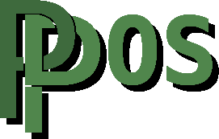

<div align="center"> 



</div>

<div align="center">

[](LICENSE)
[](https://www.raspberrypi.com/)
[](https://en.wikipedia.org/wiki/C_(programming_language))
[]()
[]()

</div>

# PPDOS - Bare Metal Operating System for Raspberry Pi

PPDOS is a simple, but powerful bare-metal operating system for Raspberry Pi boards.
It is designed to be educational, modular and readable - ideal for learning low-level ARM development or building your own projects.

> Written from scratch with custom HAL, drivers and a minimal kernel.

---

## Current features

PPDOS is in **early development**, but already supports:

- General-purpose I/O
- SPI communication
- SD Host Controller Interface (SDHCI) for read/write to SD cards
- Basic VC4 initialization over mailbox
- Modular Raspberry Pi HAL ([`./src/hal/rpi`](src/hal/rpi)) that is growing day by day

> PPDOS project was started on **June 4 2025**

---

| Board                     | Status    |
|---------------------------|-----------|
| Raspberry Pi Zero 2 W     | Fully tested (main reason behind this project) |
| Raspberry Pi 3            | Not tested, should work fine |
| Raspberry Pi 1 / 2        | Not tested, should work fine, BCM2835 is only one with broadcom documentation |
| Raspberry Pi 4            | Not tested, possibly needs some tweaks to work |
| Raspberry Pi 5            | Not tested, possibly needs some tweaks to work |

---

## Building PPDOS:
Currently you need: 
- `aarch64-none-elf-gcc` (ARM AArch64 cross-compiler)
- `cmake` (build system)
### 1. Select target board from config

Edit `kernel/hal_config.h` and uncomment line with your board name or your CPU name

Example config file for Raspberry Pi Zero 2 W:
```c
...
#define PPDOS_USE_RPI_ZERO_2_W
...
```

Make sure you have selected only one board at a time.

---
### 2. Compile the kernel

```sh
mkdir build
cd build
cmake ..
cmake --build .
```

This will make:
- `kernel8.elf` - raw ELF file
- `kernel8.img` - OS image that you copy to your SD card

---
### 3. Boot on your Pi
To boot PPDOS on your Raspberry Pi you need to copy `kernel8.img` to the boot partition of your Raspberry Pi SD card, replacing the existing image if needed (possibly save last kernel8.img image if you want to preserve it).

> Make sure the SD card has the necessary, standard Raspberry Pi boot files (`bootcode.bin`, `start.elf`, `config.txt`, etc.)

Note: `config.txt` should contain at least:
```
arm_64bit=1
kernel=kernel8.img
```

## Project structure (Work in progress)
```graph
PPDOS/
|- src/
|  |- bootloader/           # All the assembly loading stuff
|  |- common/               # Commonly used stuff in code (memcpy, uint32_t, etc.)
|  |- drivers/              # Drivers (ST7735 driver, USB driver, etc.)
|  |  |- hal/               # HAL wrappers (GPIO, SPI, etc.)
|  |  |- hid/               # USB human interface device drivers (keyboard, EMMS, etc.)
|  |- filesystem/           # File system, currently FAT16 (unfinished)
|  |- hal/                  # Lowest hardware abstraction layer libraries
|  |  |- rpi/               # Raspberry Pi HAL
|  |  |- stm32/             # In future STM32 HAL
|  |- kernel/               # PPDOS kernel
|  |  |- microAssembler/    # Embedded micro assembler for assembling and disassembling code on the PPDOS
|  |- linker.ld
|- build/                   # Build output (after cmake)
|- CMakeLists.txt
|- LICENSE
|- README.md
```

## Documentation
Each driver, HAL module, library is being documented in human-readable Markdown. You can find .md documentation among source code

> See `src/drivers/hal/gpio_docs.md` for documentation, documentation is also presented in form of a doxygen comments in `.h` files

Full documentation will be available soon. You can find documentation home page [here](src/home_docs.md)

## Why PPDOS?
> Bare metal on Raspberry Pi (maybe later other architectures/CPUs) doesn't have to be painful.

Most low-level Pi projects are either:
- Linux drivers to control external devices,
- Old tutorials written in assembly,
- Undocumented messes.

PPDOS tries to improve upon that by providing:
- Human-readable code (you need some C knowledge)
- Clear separation between HAL, drivers and typical OS stuff
- Written for learning and hacking
- Made for others to contain knowledge scattered through entire internet, so you don't have to search every link for a piece of information, I did it already for you

## Contributing & Feedback
Right now I write it as a **solo project**, but:
- Feel free to use the code
- Open issues with questions and/or ideas
- Fork or share improvements
- Or just hang around and watch it grow

## License
MIT license

## Author
Made by Piotr "UjemnyGH" Plombon
